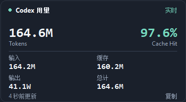

# Codex Token HUD · Token 用量悬浮条


**[English](README.md)** · Windows · Python/Tkinter · MIT

这是一个适用于 Windows 版 Codex 桌面应用的非官方悬浮 HUD。它跟随 Codex 窗口，显示当前本地聊天的 Token 用量和缓存命中率。鼠标悬停时，原胶囊会展开为同一个 HUD 中的双列用量面板。

| 折叠状态 | 展开状态 |
| --- | --- |
|  |  |

*截图使用模拟数据。*

## 功能

- **连续展开的单个 HUD：**折叠时是单行胶囊，悬停约 90 毫秒后开始展开；鼠标离开约 200 毫秒后收起。单击可固定或取消固定展开状态。
- **当前聊天用量：**显示总量、输入、输出、缓存输入、缓存命中率和相对更新时间。点击展开栏中的某项 Token 数字，可单独切换缩写和精确整数；折叠胶囊始终显示缩写。“复制”按钮可复制四项精确 Token 数值。
- **易读单位：**小于 1 万时显示完整数字；达到 1 万、100 万、10 亿后分别使用 W（万）、M（百万）、B（十亿），最多保留一位小数。
- **跟随与吸附：**拖动 HUD 并松开，可吸附到 Codex 主窗口边缘或安全标题栏区域。临时菜单不会被当成主窗口；Codex 最小化或关闭时 HUD 隐藏，其他应用窗口可正常覆盖它。
- **本地读取：**只读取本机 Codex 的用量快照和聊天目录，不向服务器发送聊天内容或用量。

## 运行条件

- Windows 和 Codex 桌面应用。
- 从源码运行需要 Python 3.12 或更新版本，以及 Pillow、pystray、comtypes。
- 当前用户能访问自己的 Codex 本地数据目录。

本项目是社区作品，**不是 OpenAI 官方产品**。它依赖 Codex 桌面窗口和本地日志的当前格式；Codex 更新后，可能需要适配。

## 从源码运行

在 PowerShell 中执行：

```powershell
git clone https://github.com/Pasitearko/codex-token-hud.git
cd codex-token-hud
py -3 -m venv .venv
.\.venv\Scripts\python.exe -m pip install --upgrade pip
.\.venv\Scripts\python.exe -m pip install pillow pystray comtypes
.\.venv\Scripts\python.exe token_strip.py
```

打开一个本地 Codex 聊天后，HUD 会出现在 Codex 窗口附近。如果无法自动确认当前聊天，可右键单击 HUD，或在系统托盘菜单中手动选择。需要彻底退出时，请在托盘菜单中选择“退出”。

## 构建便携版

在已激活的虚拟环境中运行 `powershell -ExecutionPolicy Bypass -File .\build.ps1`。生成文件位于 `dist\CodexTokenStrip.exe`。脚本会安装打包依赖，并通过 PyInstaller 构建。源码仓库有意忽略 `dist/`，因此需要从检出的源码自行构建。

## 数据来源与隐私

程序以只读方式打开 `~/.codex/sqlite/codex-dev.db`，并读取 `~/.codex/sessions/**/*.jsonl` 中的 Token 计数事件。它用当前 Codex 页面标题匹配本地聊天；无法唯一确认时显示“未识别”，并提供手动选择。统计包含子代理会话，且按每段会话的累计快照去重。

**总 Token** = 输入 + 输出；**缓存命中率** = 缓存输入 ÷ 输入。Codex 写入用量快照后数字才更新，不估算尚在生成的 Token。程序只将吸附位置保存到 `~/.codex/token-strip.json`，不会保存聊天正文。

提交问题时，请勿上传真实会话日志、数据库、聊天正文或凭据；截图请使用模拟数据或先遮盖个人信息。

## 参与贡献

参阅 [CONTRIBUTING.md](CONTRIBUTING.md)。仓库中的 UI 探针需要可交互、未锁屏的 Windows 桌面，不适合作为无界面的 CI 测试。可运行下列自动回归测试并检查 Python 语法：

```powershell
python -m unittest discover -s tests -p 'test_*.py'
python -m py_compile token_strip.py smooth_capsule.py
```

## 开源协议

本项目采用 [MIT 协议](LICENSE)。
